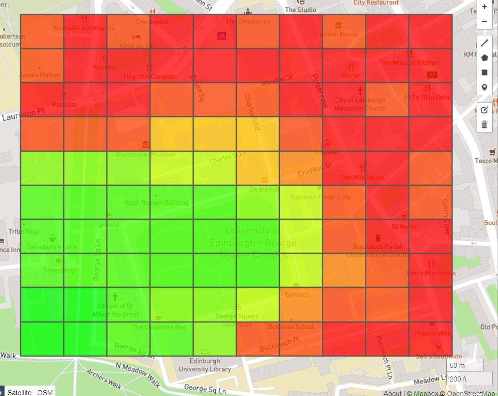
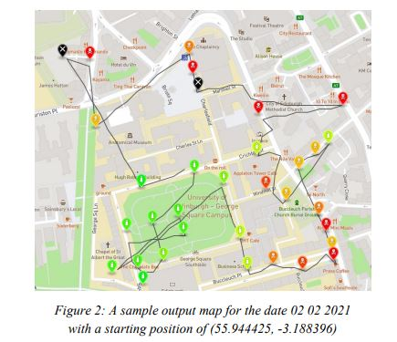
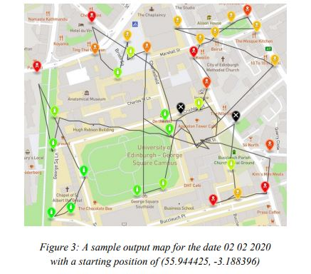

# Informatics Large Practical
Here is my repository for my project for Informatics Large Practical (a UG3 course, run by the School of Informatics at University of Edinburgh).
The background for the project is that a (fictitious) research group are studying the urban air quality of a given geographical area (University of Edinburgh's Central Area) and the researchers require help to program a drone to visit sensors, positioned around the urban area.

### Technologies Used

- Java
- GeoJSON
- JSON Parsing
- Maven
- JUnit
- Web Server / HTTP Client

## Task 1 - Heatmap Generation
A heat map needs to be created, to allow researchers to visualise the air polution levels across the set geographical area. In a heat map, data values are shown as colours. The task is to implement a program that takes the researcher's input of predictions (from a text file) and outputs a generated geoJSON file that accurately visualises this data into a heatmap.

**Key**
- Green = Low Pollution Reading
- Orange = Medium Pollution Reading
- Red = High Pollution Reading
- Black = Low Battery Sensor

_Note: The details of the key are shown in full in the project specification._

### Example Results
Here is an example heatmap generation, rendered using geojson.io :

## Task 2 - Autonomous Drone Sensor Collecting
The task is based on a drone used to collect sensor readings, analysing urban air quality,
around a specific confinement zone in central Edinburgh, for a hyperthetical, small-scale
study around the University of Edinburgh's Central Area. Some key requirements are:

- The drone has 150 moves maximum
- The drone should mark low-battery sensor readings as unreliable
- The drone cannot fly through specified no-fly zones (e.g. over some buildings)
- The drone can be started from any point within the urban area and should finish as close to the start as possible
- The sensors' locations are given in What3Words

All distances are in degrees, and all points are in latitiude and longitude coordinates.

### Example Results
Here are two figures that show two different routes generated using my implementation.

## Marks & Feedback
| Coursework Task            | Mark Received | Total    |
| -------------------------- | ------------- | -------- |
| Task 1                     | 24            | 25       |
| Task 2                     | 65            | 75       |
| Total                      | 89            | 100      |

This included full marks for my report (within Task 2, 30 marks), acting as documentation for the written program. This includes outlining the methods, attributes, and providing summaries of the algorithms used, as a technical document.
